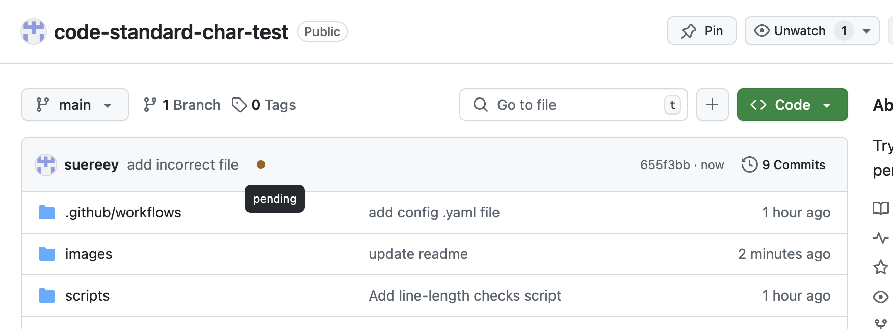
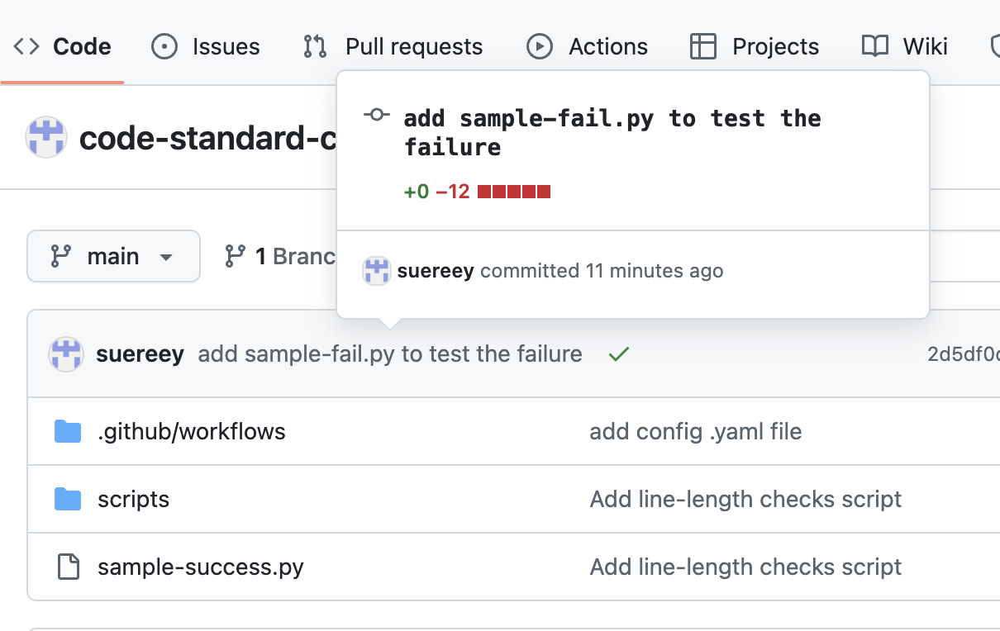
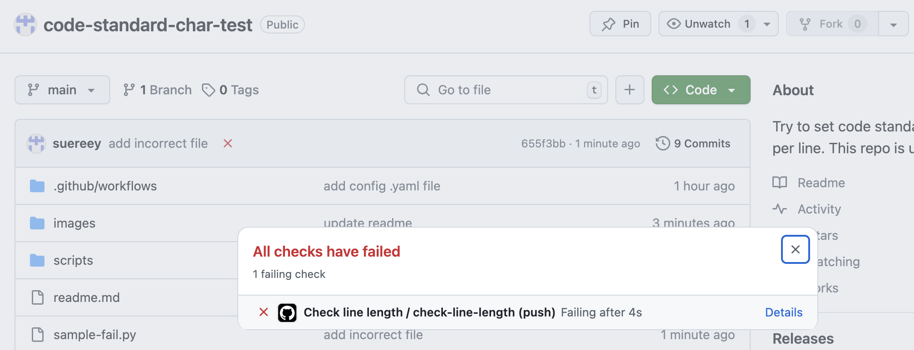
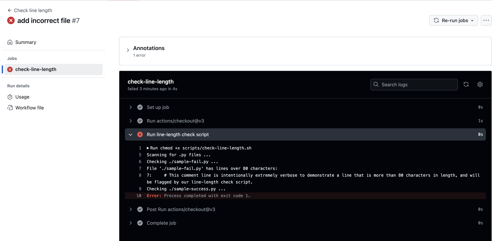

# Enforcing Max 80 Character Line Length
This repository enforces a coding standard: no line of code should exceed 80 characters. We use a shell script to detect long lines and a GitHub Actions workflow to automatically check each push and pull request.

See Section 3.3 for details. 

**Examples of this Git push being checked**


**Example of this Git push failing**


**Example of a successful Git push.**



## 1. Script Location and Usage
Location:
- The enforcement script is located at scripts/check-line-length.sh.
- This script scans all files (that match certain extensions) for lines longer than 80 characters.

Usage (Locally):

Make sure the script is executable:
```
chmod +x scripts/check-line-length.sh
```
Run it manually at any time:
```
./scripts/check-line-length.sh
```

If any lines exceed 80 characters, the script will:
- Print the path of the file(s) and the line number(s).
- Exit with a non-zero status, indicating a failure.

## 2. GitHub Actions Workflow
Location:

The GitHub Actions workflow YAML file is at ```.github/workflows/check-line-length.yml```.

GitHub automatically recognizes any ```.yml``` or ```.yaml``` files in ```.github/workflows``` as workflows.

What It Does:

On every push or pull request to the main branch, it:
- Checks out the code.
- Makes the scripts/check-line-length.sh script executable.
- Runs the script.
- Fails the workflow if any file has lines longer than 80 characters.

## 3. How to Set It Up:

### 3.1 Add the YAML Workflow File

If you need to create a workflow from scratch, put a file (e.g., ```check-line-length.yml```) in ```.github/workflows/```.
Example content:
```
name: Check line length

on:
  push:
    branches: [ "main" ]
  pull_request:
    branches: [ "main" ]

jobs:
  check-line-length:
    runs-on: ubuntu-latest
    steps:
      - uses: actions/checkout@v3
      - name: Run line-length check
        run: |
          chmod +x scripts/check-line-length.sh
          ./scripts/check-line-length.sh
```

### 3.2 Commit and Push
```
git add .github/workflows/check-line-length.yml
git commit -m "Add line length check workflow"
git push
```

### 3.3 Verify on GitHub
- Go to your repo’s “Actions” tab; you should see the new workflow.
- When you open or update a pull request (or push commits), the workflow will run.

Example of checking:


Example of pass:


Example of failure:


**When it fails, click on Details to see where the failure occurred.**
